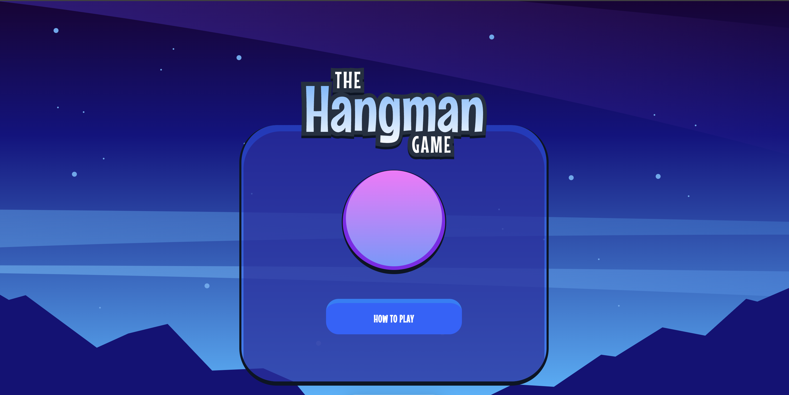

# Frontend Mentor - Hangman game solution

This is a solution to the [Hangman game challenge on Frontend Mentor](https://www.frontendmentor.io/challenges/hangman-game-rsQiSVLGWn). Frontend Mentor challenges help you improve your coding skills by building realistic projects.

## Table of contents

- [Overview](#overview)
  - [The challenge](#the-challenge)
  - [Screenshot](#screenshot)
  - [Links](#links)
- [My process](#my-process)
  - [Built with](#built-with)
  - [What I learned](#what-i-learned)
  - [Continued development](#continued-development)
  - [Useful resources](#useful-resources)
- [Author](#author)
- [Acknowledgments](#acknowledgments)

## Overview

### The challenge

Users should be able to:

- Learn how to play Hangman from the main menu.
- Start a game and choose a category.
- Play Hangman with a random word selected from that category.
- See their current health decrease based on incorrect letter guesses.
- Win the game if they complete the whole word.
- Lose the game if they make eight wrong guesses.
- Pause the game and choose to continue, pick a new category, or quit.
- View the optimal layout for the interface depending on their device's screen size.
- See hover and focus states for all interactive elements on the page.
- Navigate the entire game only using their keyboard.

### Screenshot



### Links

- Solution URL: [https://github.com/mrvicthor/hangman-game]
- Live Site URL: [https://hangman-game-app.vercel.app/]

## My process

### Built with

- Semantic HTML5 markup
- CSS custom properties
- Flexbox
- CSS Grid
- Mobile-first workflow
- [React](https://reactjs.org/) - JS library
- [Next.js](https://nextjs.org/) - React framework

### What I learned

To see how you can add code snippets, see below:

```js
export const generateHiddenLetters = (
  phrase: string,
  revealPercentage: number
): Set<string> => {
  // Get unique letters excluding spaces
  const uniqueLetters = Array.from(
    new Set(phrase.replace(/\s/g, "").split(""))
  );

  // Shuffle array
  const shuffledLetters = [...uniqueLetters].sort(() => Math.random() - 0.5);

  // calculate how many letters to hide
  const numToHide = Math.floor(uniqueLetters.length * (1 - revealPercentage));

  // Return set of hidden letters
  return new Set(shuffledLetters.slice(0, numToHide));
};
// used in constraining the value, and ensures it is never negative
const constrainedValue = Math.max(0, prevState - 100 / MAX_MISTAKES);
```

### Continued development

I plan to focus more on NextJs and take up more data and algorithm challenge. I believe this will help me improve my problem solving skills as well. Also, I just picked up a TDD course which I intend to implement in my next project.

### Useful resources

- [https://nextjs.org/] - This is an amazing article which helped me finally understand the new nextjs feature updates. I'd recommend it to anyone still learning this concept.

## Author

- Website - [https://t.co/GyuJhbPKuM]
- Frontend Mentor - [https://www.frontendmentor.io/profile/mrvicthor]
- Twitter - [https://t.co/GyuJhbPKuM]

## Acknowledgments

I will like to acknowledge FeeqCoodes (https://dev.to/feeqcodes/display-json-data-in-nextjs-1hde). His post was helpful in determining how to load local json file in nextjs project.
